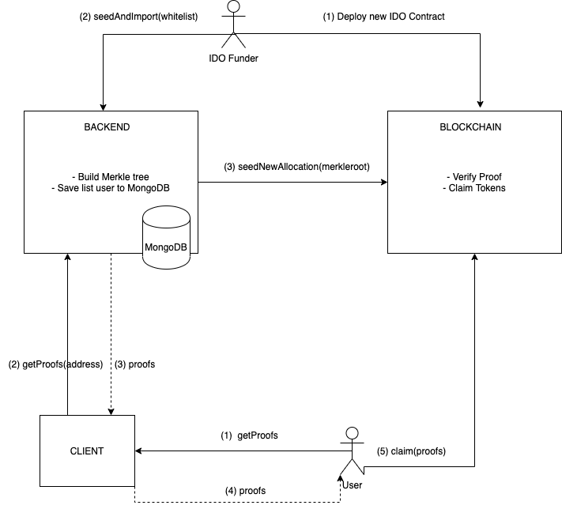

<h1 align="center">
   
      
   
  Merkle Starter
   
</h1>

<h4 align="center">IDO platform, built on BSC with Merkle tree structure.</h4>

## Features

- Faster.
- Cheaper.
- Whitelist with thousands of users.
- Cost less transactions.

## Motivation
Why we create Merklestarter ? recently we were trying to join some IDO on Polkastarter, and got angry. The site is too slow, no way to join only 300 people in whitelist. Going deeper in contract interaction, it shows very limited function because each time we can only add 100 people to receiver list. Furthermore, user must send 2 transaction to get token, swap and claim, which cost gas too much.
Merklestarter will let funder easier to raise fund, once for thousand people, and user only need to claim by sending only 1 transaction.

## How Merklestarer works?

### IDO Operator
- Step 1: Prepare whitelist data, it can add thousands user at once (incomparison with 100 of Polkastarter)
- Step2: there is no operator page now (will be developed next), so it can be done by run script `server/operator/seedThenImport.js` script to do 2 things: first calculate Merkle root, then seed that Merkle Root to MerkleStarter contract; second is import list of whitelist users into MongoDB, which will be used to build proofs.

### User
- Go to client page, claim their tokens. For more detail, first users address will be send to server to check whitelist status in MongoDB, then if valid, server will response a Merkle Proof of that address, which will be submited to MerkleStater contract to verify, then claim their tokens, all on 1 transaction only.

## Curren Development Progress

- [x] Smart Contracts: Done
- [x] Server: Done
- [x] Client: Done
- [ ] Operator Page: To be developed, now run by scripts only
- [ ] Crosschain: To be developed

## Instructions

See [Instructions](Instructions.md) for more details.

## LICENSE

